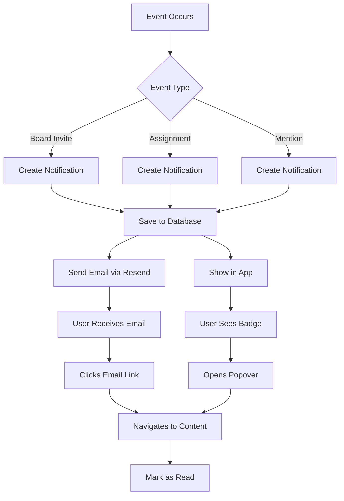

Better Todo keeps you informed about important events through a comprehensive notification system with both in-app and email delivery.

## Notification Types

Better Todo generates notifications for key collaboration events:

<CardGroup cols={2}>
  <Card title="Board Invites" icon="envelope">
    Receive notifications when someone invites you to collaborate on a board.
    
    **Triggers:**
    - Email invitation sent
    - In-app notification created
    - Link to accept or decline
  </Card>
  
  <Card title="Card Assignments" icon="user-check">
    Get notified when you're assigned to a card.
    
    **Triggers:**
    - Another user assigns you
    - Email with card details
    - Direct link to the card
  </Card>
  
  <Card title="Mentions" icon="at-sign">
    Stay in the loop when someone mentions you in comments.
    
    **Triggers:**
    - @mention in card comment
    - Context from the comment
    - Link to the discussion
  </Card>
  
  <Card title="Due Dates" icon="calendar-clock">
    Never miss deadlines with due date reminders.
    
    **Triggers:**
    - Card due date approaching
    - Overdue card alerts
    - Assignment-based reminders
  </Card>
</CardGroup>

## Notification Schema

Notifications in Better Todo follow this structure:

```typescript
{
  userId: string,           // Recipient user ID
  type: string,            // Notification type
  title: string,           // Notification title
  message: string,         // Notification message
  linkUrl?: string,        // Optional deep link
  read: boolean,           // Read status
  createdAt: number        // Timestamp
}
```

### Notification Types

| Type | Description | Example Message |
|------|-------------|----------------|
| `board_invite` | Board invitation | "You've been invited to join 'Project Launch'" |
| `assignment` | Card assignment | "John assigned you to 'Implement auth'" |
| `mention` | Comment mention | "Sarah mentioned you in a comment" |
| `due_date` | Due date reminder | "Card 'Deploy feature' is due tomorrow" |
| `comment` | New comment | "New comment on 'Bug fix'" |

### Deep Links

Notifications include `linkUrl` for direct navigation:

```typescript
// Board invite
linkUrl: "/boards/board_id"

// Card assignment
linkUrl: "/boards/board_id?card=card_id"

// Comment mention
linkUrl: "/boards/board_id?card=card_id#comment-id"
```

## In-App Notifications

Access notifications through the notifications popover:

### Viewing Notifications

```typescript
// Get all notifications for current user
const notifications = await getNotifications();

// Get unread count
const unreadCount = await getUnreadCount();
```

<Accordion title="Notification Display">
  The `NotificationsPopover` component provides:
  
  - **Bell icon** with unread badge in header
  - **Unread count** displayed as badge ("9+" for 10+)
  - **Scrollable list** of notifications (400px height)
  - **Mark all read** button when unread exist
  - **Empty state** when no notifications
  
  ```typescript
  <NotificationsPopover />
  ```
</Accordion>

### Notification Items

Each notification displays:

- **Icon** based on notification type
- **Title** and message content
- **Timestamp** (relative: "2 hours ago")
- **Read/unread** visual indicator
- **Click action** to navigate to linked content

### Managing Notifications

<Tabs>
  <Tab title="Mark as Read">
    Mark individual notifications as read:
    
    ```typescript
    await markAsRead({ notificationId: "notification_id" });
    ```
    
    Automatically marked when clicking the notification.
  </Tab>
  
  <Tab title="Mark All Read">
    Clear all unread notifications:
    
    ```typescript
    await markAllAsRead();
    ```
    
    Available via the "Mark all read" button in the popover.
  </Tab>
  
  <Tab title="Delete">
    Remove notifications:
    
    ```typescript
    await deleteNotification({ notificationId: "notification_id" });
    ```
  </Tab>
</Tabs>

## Email Notifications

Better Todo sends professional email notifications via Resend for important events:

### Email Templates

All emails use a consistent, beautiful template with:

- **Dark theme** design (matches Better Todo brand)
- **Gradient accent** bars (indigo → violet → pink)
- **Branded header** with logo
- **Clear CTAs** (call-to-action buttons)
- **Responsive** mobile-friendly layout

### Board Invite Emails

<Accordion title="For Registered Users">
  Email includes:
  
  - **Personalized greeting** with recipient name
  - **Inviter name** prominently displayed
  - **Board title** in a styled card
  - **Role badge** showing assigned role
  - **"Accept Invitation" CTA** button
  - **Alternative note** about in-app notification
  
  ```typescript
  await sendBoardInviteEmail({
    to: "user@example.com",
    recipientName: "John Doe",
    inviterName: "Sarah Smith",
    boardTitle: "Q1 Product Launch",
    boardId: "...",
    role: "member",
    inviteId: "..."
  });
  ```
  
  Subject: `"Sarah Smith invited you to 'Q1 Product Launch' on BetterTodo"`
</Accordion>

<Accordion title="For Unregistered Users">
  Email includes:
  
  - **Welcoming message** introducing Better Todo
  - **Board details** and role assignment
  - **3-step process** explanation
  - **"Accept & Create Account" CTA** button
  - **"Sign in instead" secondary button**
  - **Security note** about token expiration
  
  ```typescript
  await sendBoardInviteEmailExternal({
    to: "newuser@example.com",
    inviterName: "Sarah Smith",
    boardTitle: "Q1 Product Launch",
    role: "member",
    token: "secure_token_123"
  });
  ```
  
  Subject: `"Sarah Smith invited you to collaborate on BetterTodo"`
</Accordion>

### Card Assignment Emails

```typescript
await sendCardAssignmentEmail({
  to: "assignee@example.com",
  recipientName: "John Doe",
  assignerName: "Sarah Smith",
  cardTitle: "Implement user authentication",
  boardTitle: "Backend Sprint",
  boardId: "...",
  cardId: "..."
});
```

**Email includes:**

- 📌 **Pin icon** header
- **"You were assigned a task!" headline**
- **Board and card names** in context card
- **"View Card" CTA** button
- **Navigation hint** (Board → Card)

**Subject:** `"Sarah Smith assigned you to 'Implement user authentication'"`

### Email Configuration

Emails are sent using Resend:

```typescript
// Environment variables required:
RESEND_API_KEY=re_...
FROM_EMAIL=notifications@yourdomain.com
SITE_URL=https://yourdomain.com
```

<Note>
  The `FROM_EMAIL` defaults to "onboarding@resend.dev" if not set, but you should use a custom domain for production.
</Note>

## Notification Queries

Better Todo uses efficient database indexes for notifications:

```typescript
// Indexes in schema:
.index("by_user", ["userId"])
.index("by_user_read", ["userId", "read"])
.index("by_user_time", ["userId", "createdAt"])
```

This enables fast queries for:

- All notifications for a user
- Unread notifications only
- Time-ordered notification feed

## Creating Custom Notifications

Create notifications programmatically:

```typescript
await createNotification({
  userId: "recipient_user_id",
  type: "custom_event",
  title: "Important Update",
  message: "Your board settings have been updated",
  linkUrl: "/boards/board_id/settings",
  read: false
});
```

## Notification Preferences

While not yet implemented in the schema, consider these future features:

<Accordion title="Email Preferences (Planned)">
  Future notification preferences may include:
  
  - Enable/disable email notifications
  - Per-type notification settings
  - Digest mode (daily/weekly summaries)
  - Quiet hours configuration
  - Mobile push notification toggle
</Accordion>

## Best Practices

<CardGroup cols={2}>
  <Card title="Check Regularly" icon="bell">
    Make it a habit to check notifications at the start of your workday to stay updated on team activity.
  </Card>
  
  <Card title="Mark as Read" icon="check">
    Keep your notification list clean by marking items as read once you've addressed them.
  </Card>
  
  <Card title="Use Deep Links" icon="link">
    Click notification links to navigate directly to the relevant board or card for context.
  </Card>
  
  <Card title="Don't Ignore Assignments" icon="user-check">
    Respond promptly to assignment notifications - your team is counting on you.
  </Card>
  
  <Card title="Enable Email" icon="mail">
    Keep email notifications enabled to stay informed even when not using the app.
  </Card>
  
  <Card title="Watch for Due Dates" icon="calendar">
    Pay attention to due date notifications to avoid missing important deadlines.
  </Card>
</CardGroup>

## Notification Workflow



## Email Template Customization

The email templates use these brand colors:

| Element | Color | Usage |
|---------|-------|-------|
| Brand Accent | `#6366f1` (indigo-500) | Primary buttons, accents |
| Background | `#0f0f13` | Dark base background |
| Card Background | `#18181f` | Content card background |
| Border | `#27272a` | Borders and dividers |
| Text Primary | `#f4f4f5` | Headlines and important text |
| Text Secondary | `#a1a1aa` | Body text |
| Text Muted | `#52525b` | Footer and fine print |

### Role Badge Colors

```typescript
const roleBadgeColors = {
  admin: "#7c3aed",   // purple
  member: "#0284c7",  // blue
  viewer: "#059669"   // green
};
```